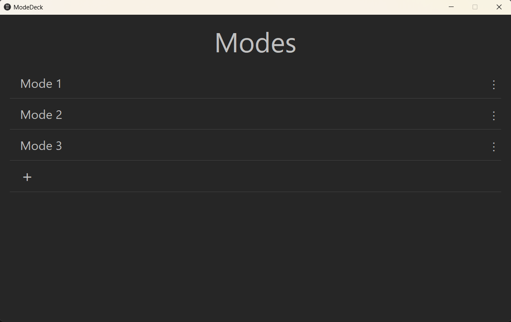
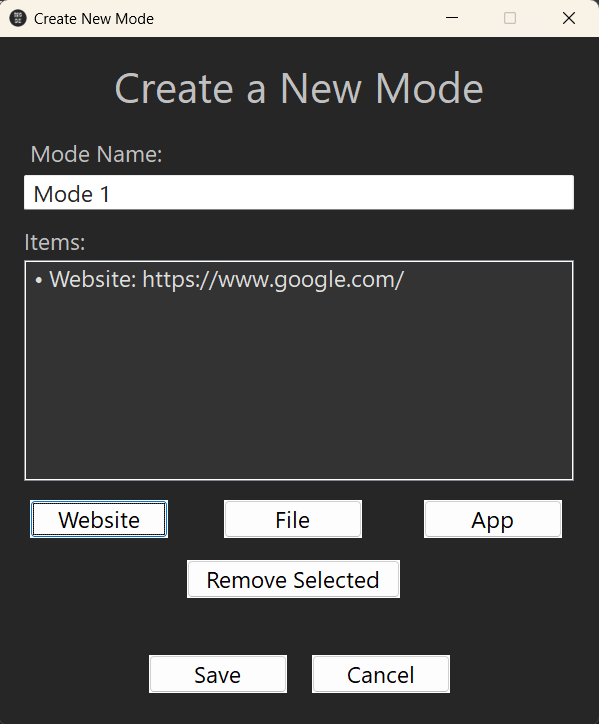

# ModeDeck

**ModeDeck** is a lightweight, open-source Windows tool built with AutoHotkey v2. It lets you create and launch "modes" — sets of apps, files, and URLs that open together.

Stop opening the same tabs, documents, and apps manually. Switch between **Work**, **Study**, or **Watch** modes instantly with one click.

_(Please Note that when opening a Mode for the first time you will need to login and sign-up again in the case of website BUT DON'T WORRY you will only need to do this the first time!)_

---

## ✨ Features

- **Create custom modes**: Add apps, files, and URLs to launch together.
- **Quick launch**: Launch via the main window.
- **Lightweight**: Minimal memory/CPU use, perfect for older laptops.
- **Auto-start option**: Keep ModeDeck running in the tray on Windows startup.
- **No login required**: Everything is saved locally per user account.

---

## 📥 Download

1. **Download the latest release** from [Releases](https://github.com/Aphene101/ModeDeck/releases)
2. Run `ModeDeck.exe` — no installation required!
   _(Optional)_ Use the installer version for Start Menu shortcuts and uninstall support.

---

## 🚀 Quick Start

1. Launch ModeDeck (tray icon appears).
2. Click + → **New Mode (Wizard)** to create your first mode.
3. Add items (apps, files, URLs) using the wizard.
   
4. Launch a mode via:
   - Main window → Select Mode
